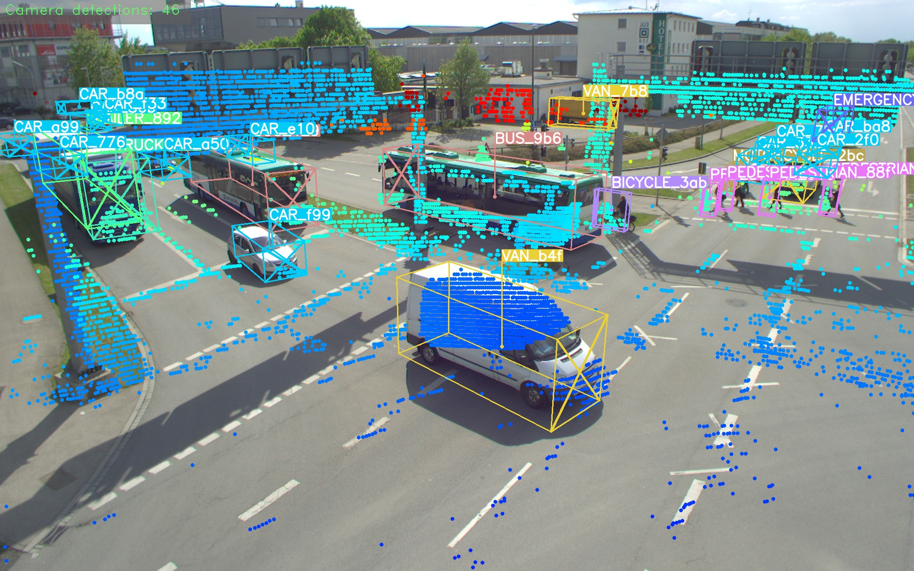
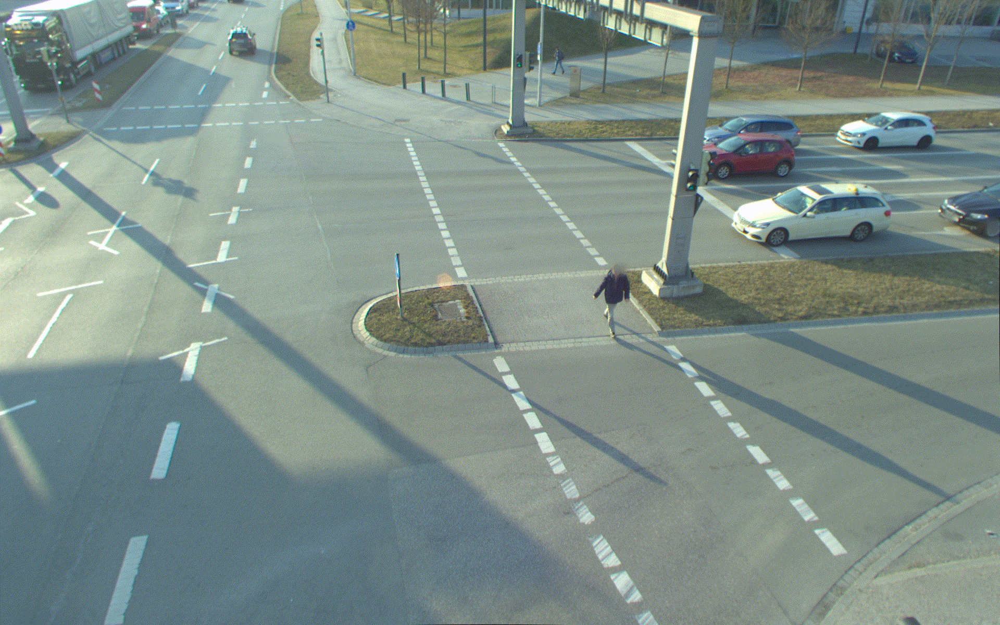
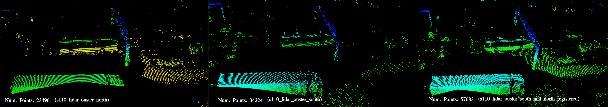
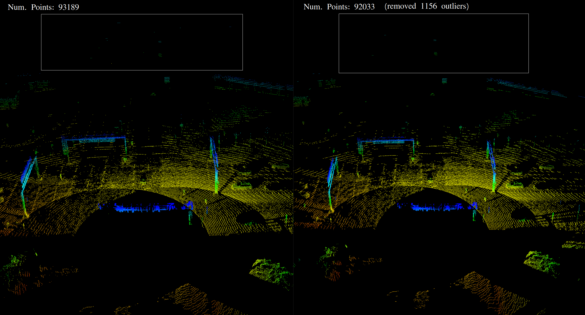

# A9-Dataset Development Kit

The A9 Dataset is based on roadside sensor data from the 3 km long  Providentia++ test field near Munich in Germany. The dataset includes anonymized and precision-timestamped multi-modal sensor and object data in high resolution, covering a variety of traffic situations. We provide camera and LiDAR frames from overhead gantry bridges with the corresponding objects labeled with 3D bounding boxes. The dataset is available for download at https://a9-dataset.com.

The A9 Development Kit provides a dataset loader for images, point clouds, labels and calibration data. The calibration loader reads the intrinsic and extrinsic calibration information. The projection matrix is then used to visualize the 2D and 3D labels on cameras images. 

## Installation
For the installation, we rely on Anaconda and Pip. First, an Anaconda environment is created:
```
conda create --name a9-dev-kit python=3.9
conda activate a9-dev-kit
```
After that, we need to install the dependencies to our A9 Development Kit. First, we have to install PyTorch3D.
```
conda install -c conda-forge fvcore
conda install -c conda-forge iopath
```
In case, you are using NVIDIA Cuda below 11.6, additional steps are required:
```
curl -LO https://github.com/NVIDIA/cub/archive/1.10.0.tar.gz
tar xzf 1.10.0.tar.gz
export CUB_HOME=$PWD/cub-1.10.0
```
Then, finally we can install PyTorch3D:
```
pip install --no-index --no-cache-dir pytorch3d -f https://dl.fbaipublicfiles.com/pytorch3d/packaging/wheels/py39_cu113_pyt1121/download.html
```
Further information is available here: https://github.com/facebookresearch/pytorch3d/blob/main/INSTALL.md

After this, we are able to install the other dependencies:

```
pip install -r requirements.txt
pip3 install --upgrade git+https://github.com/klintan/pypcd.git
```


## Release History
The A9 Dataset contains the following releases:
* R00: Released 2022-04 (A9 Highway Data) 
* R01: Released 2022-07 (A9 Highway Data with new sequences from real accidents)
* R02: Released 2023-06 (A9 Intersection data)

## Dataset Structure
#### a9_r00
The `a9_r00` dataset contains 5 subsets (`s00` to `s04`) and is structured in the following way:

The first 3 sets `a9_dataset_r00_s00`, `a9_dataset_r00_s01` and `a9_dataset_r00_s02` contain image data (`.png`) from roadside cameras with corresponding label files (stored in OpenLABEL `.json` format) and calibration data:
``` 
├── a9_dataset_r00_s00
│   ├── _images
│   │   ├── s040_camera_basler_north_16mm
│   │   ├── s040_camera_basler_north_50mm
│   │   ├── s050_camera_basler_south_16mm
│   │   ├── s050_camera_basler_south_50mm
│   ├── _labels
│   │   ├── s040_camera_basler_north_16mm
│   │   ├── s040_camera_basler_north_50mm
│   │   ├── s050_camera_basler_south_16mm
│   │   ├── s050_camera_basler_south_50mm
│   ├── _calibration
│   │   ├── s040_camera_basler_north_16mm.json
│   │   ├── s040_camera_basler_north_50mm.json
│   │   ├── s050_camera_basler_south_16mm.json
│   │   ├── s050_camera_basler_south_50mm.json
```

The last two sets `a9_dataset_r00_s03`, and `a9_dataset_r00_s04` contain point cloud data (`.pcd`) from roadside LiDARs with corresponding label files (stored in OpenLABEL `.json` format) and calibration data:
``` 
├── a9_dataset_r00_s03
│   ├── _points
│   ├── _labels
```


#### a9_r01
The `a9_r01` dataset contains 3 subsets (`s01` to `s03`) and is structured in the following way:

Example: a9_dataset_r01_s01:
``` 
├── a9_dataset_r01_s03
│   ├── _images
│   │   ├── s040_camera_basler_north_16mm
│   │   ├── s040_camera_basler_north_50mm
│   │   ├── s050_camera_basler_south_16mm
│   │   ├── s050_camera_basler_south_50mm
│   ├── _labels
│   │   ├── s040_camera_basler_north_16mm
│   │   ├── s040_camera_basler_north_50mm
│   │   ├── s050_camera_basler_south_16mm
│   │   ├── s050_camera_basler_south_50mm
│   ├── _calibration
│   │   ├── s040_camera_basler_north_16mm.json
│   │   ├── s040_camera_basler_north_50mm.json
│   │   ├── s050_camera_basler_south_16mm.json
│   │   ├── s050_camera_basler_south_50mm.json
```

#### a9_r02
The `a9_r02` dataset contains 4 subsets (`s01` to `s04`) and is structured in the following way:

Example: a9_dataset_r02_s01:
``` 
├── a9_dataset_r02_s01
│   ├── _images
│   │   ├── s110_camera_basler_south1_8mm
│   │   ├── s110_camera_basler_south2_8mm
│   ├── _labels
│   │   ├── s110_lidar_ouster_south
│   │   ├── s110_lidar_ouster_north
│   ├── _points_clouds
│   │   ├── s110_lidar_ouster_south
│   │   ├── s110_lidar_ouster_north
```

## 1. Label Visualization
### 1.1 Visualization of labels in camera images 
The following visualization script can be used to draw the 2D and/or 3D labels on camera frames:

```
python dataset-dev-kit/src/visualization/visualize_image_with_3d_boxes.py --camera_id s110_camera_basler_south1_8mm \
                                                                          --lidar_id s110_lidar_ouster_south \
                                                                          --input_folder_path_images <IMAGE_FOLDER_PATH> \
                                                                          --input_folder_path_point_clouds <POINT_CLOUD_FOLDER_PATH> \
                                                                          --input_folder_path_labels <LABEL_FOLDER_PATH> \
                                                                          --viz_mode [box2d,box3d,point_cloud,track_history] \
                                                                          --viz_color_mode [by_category,by_track_id] \
                                                                          --output_folder_path_visualization <OUTPUT_FOLDER_PATH>
```
 


### 1.2 Visualization of labels in LiDAR point cloud scans
The script below draws labels on a LiDAR frame:

```
python a9-dev_kit/src/visualization/visualize_point_cloud_with_labels.py --input_folder_path_point_clouds <INPUT_FOLDER_PATH_POINT_CLOUDS> \
                                                                         --input_folder_path_labels <INPUT_FOLDER_PATH_LABELS> \
                                                                         --save_visualization_results \
                                                                         --output_folder_path_visualization_results <OUTPUT_FOLDER_PATH_VISUALIZATION_RESULTS>
```


## 2. Image Undistortion/Rectification
The development kit also contains a script to undistort camera images:

```
python a9-dev-kit/src/preprocessing/undistort_images.py --input_folder_path_images a9_dataset/r00_s00/_images/s040_camera_basler_north_16mm \
                                                        --file_path_calibration_parameter a9_dataset/r00_s00/_calibration/s40_camera_basler_north_16mm.json \
                                                        --output_folder_path_images a9_dataset/r00_s00/_images_undistorted
```
An example between a distorted an undistorted image is shown below:


## 3. Point Cloud Pre-Processing

### 3.1 Point Cloud Registration

The following script can be used to register point clouds from two different LiDARs:
```
python a9-dev-kit/src/preprocessing/register_point_clouds.py --folder_path_point_cloud_source <INPUT_FOLDER_PATH_POINT_CLOUDS_SOURCE> \
                                                             --folder_path_point_cloud_target <INPUT_FOLDER_PATH_POINT_CLOUDS_TARGET> \
                                                             --save_registered_point_clouds \
                                                             --output_folder_path_registered_point_clouds <OUTPUT_FOLDER_PATH_POINT_CLOUDS>
```


### 3.2 Noise Removal
A LiDAR preprocessing module reduces noise in point cloud scans:

```
python a9-dev-kit/src/preprocessing/remove_noise_from_point_clouds.py --input_folder_path_point_clouds <INPUT_FOLDER_PATH_POINT_CLOUDS> \
                                                                       --output_folder_path_point_clouds <OUTPUT_FOLDER_PATH_POINT_CLOUDS>
```


## 4. Label Conversion
In addition, a data converter/exporter enables you to convert the labels from OpenLABEL format into other formats like KITTI, COCO or YOLO and the other way round. 


[TODO]: https://github.com/eweill/convert-datasets/blob/master/datasets/kitti.py
[TODO]: https://doc.scalabel.ai/label.html

### OpenLABEL to YOLO
The following script converts the OpenLABEL labels into YOLO labels:
```
python a9-dev-kit/src/converter/conversion_openlabel_to_yolo.py --input_folder_path_labels <INPUT_FOLDER_PATH_LABELS> \
                                                                     --output_folder_path_labels <OUTPUT_FOLDER_PATH_LABELS>
```


## 5. Data Split
The script below splits the dataset into `train` and `val`:

```
python a9-dev-kit/src/preprocessing/create_train_val_split.py --input_folder_path_dataset <INPUT_FOLDER_PATH_DATASET> --input_folder_path_data_split_root <INPUT_FOLDER_PATH_DATA_SPLIT_ROOT>
```


## 6. Evaluation Script
Finally, a model evaluation script is provided to benchmark your models on the A9-Dataset.
```
python eval/evaluation.py --folder_path_ground_truth ${FILE/DIR} --folder_path_predictions ${FILE/DIR}  [--object_min_points ${NUM}]
```
Dataformat of predictions - one TXT file per frame with the content (one line per predicted object): class x y z l w h rotation_z.<br>
Example
```
Car 16.0162 -28.9316 -6.45308 2.21032 3.74579 1.18687 2.75634
Car 17.926 -19.4624 -7.0266 1.03365 0.97037 0.435425 0.82854
```
Example call to compare one ground truth file with one prediction file visually:
```
python eval/evaluation.py --folder_path_ground_truth /home/marcel/Repositorys/a9_dataset_r01_test/labels/1651673050_454284855_s110_lidar_ouster_south.json --folder_path_predictions /home/marcel/Repositorys/toolchain/package/lidar_3d_object_detection_unsupervised/inference/detections_a9_dataset_r01_test/1651673050_454284855_s110_lidar_ouster_south.txt --object_min_points 0
```
Example call to evaluate the whole set if gound truth bounding boxes enclose more than 20 points:
```
python eval/evaluation.py --folder_path_ground_truth /home/marcel/Repositorys/a9_dataset_r01_test/labels --folder_path_predictions /home/marcel/Repositorys/toolchain/package/lidar_3d_object_detection_unsupervised/inference/detections_a9_dataset_r01_test --object_min_points 20
```
Final result when evaluating the A9-Dataset R1 test set vs. itself:
```

|AP@50             |overall     |Occurrence (pred/gt)|
|Vehicle           |100.00      |2110/2110           |
|Pedestrian        |100.00      |32/32               |
|Bicycle           |100.00      |156/156             |
|mAP               |100.00      |2298/2298 (Total)   |
```

# License

The dataset itself is released under the [Creative Commons Attribution-NonCommercial-NoDerivatives 4.0 International License (CC BY-NC-ND 4.0)](https://creativecommons.org/licenses/by-nc-nd/4.0/). 
By downloading the dataset you agree to the [terms](https://a9-dataset.innovation-mobility.com/license) of this license.


The A9 Dataset Development Scripts are released under MIT license as found in the license file.

# Contact

Please feel free to contact us with any questions, suggestions or comments:

    Walter Zimmer (walter.zimmer@tum.de)
    Christian Creß (christian.cress@tum.de)
    Venkat Lakshmi (venkat.lakshmi@tum.de)
    Leah Strand (leah.strand@tum.de)
